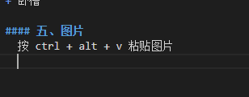

<!--
 * @Author: Connor2Chen 397080067@qq.com
 * @Date: 2024-09-05 11:05:34
 * @LastEditors: Connor2Chen 397080067@qq.com
 * @LastEditTime: 2024-10-12 16:05:52
 * @FilePath: \Learning-Note\01_SoftWare\01_MarkDown\01_markdown基本用法.md
 * @Description: 
 * 学习自
 * https://blog.csdn.net/hyupeng1006/article/details/129590409?ops_request_misc=%257B%2522request%255Fid%2522%253A%2522F2BD4299-5B8F-4C35-BA16-723B17C08508%2522%252C%2522scm%2522%253A%252220140713.130102334..%2522%257D&request_id=F2BD4299-5B8F-4C35-BA16-723B17C08508&biz_id=0&utm_medium=distribute.pc_search_result.none-task-blog-2~all~top_click~default-2-129590409-null-null.142^v100^pc_search_result_base2&utm_term=vscode%E4%BD%BF%E7%94%A8markdown&spm=1018.2226.3001.4187
 * 
 * Copyright (c) 2024 by ${git_name_email}, All Rights Reserved. 
-->

---

[TOC]

---

# MarkDwon 基础部分
---
## 一、标题
    使用#+空格 可以设置标题，
    N级标题就是N个#+空格，最多可以6级标题；
---
## 二、分段与换行
    在Markdown中,回车不可以换行，只是在给文字空格。
   比如A
   B

    若是要换行，可以打两个回车
---
## 三、强调
    斜体使用在文本两端各加一个 * 号；
    加粗则在文本两端各加两个 * 号；
    
    下划线利用<u> </u>;
    上划线利用$\bar{}$
    长句上划线用$\overline{}$
如 *A*    **B**    <u>C</u>    $\bar{a}$   $\overline{A}$

---

## 四、列表
### 有序列表
    输入1.加一个空格（注意有点”.“），按回车会自动补全编号
    如果要输入分级列表，回车并删除新生成的序列号并再次输入1.空格
    如果要加入新的列表则在两个列表之间新起一段，或者添加文字
如
1. 卧槽
     1. 卧槽
2. 卧槽

### 无序列表
    输入星号"*"加空格或者加号"+"加空格或者减号"-"加空格 
* 卧槽
  + 卧槽
---


## 五、图片
    按 ctrl + alt + v 粘贴图片



---

## 六、数学公式
    数学公式以 \ 起始，在当前行内采用数学公式用一对$括起来,
    另起一行用一对$$;
$$
\lim_{x \to \infin}\frac{sin(t)}{x}=1
$$
或者是  $\lim_{x \to \infin}f{x}$  这样；


>公式：
<br>1.上下标       ^与_
<br>2.分数        \frac{}{}
<br>3.求和        \sum_{}^{}{}
<br>4.累乘        \prod_{}^{}{}
<br>5.开方        \sqrt{}
<br>6.积分        \int_{}^{}{}
<br>7.头上来个点  \dot{}
---

## 七、表格
    第一行是表头以”|“区分列
    第二行是对齐方式， "-"表示默认对其即左对齐
    在"-"左侧加":"为左对齐
    在右侧加":"为右对齐
    两边都加":"为剧中对齐
    （"-"的个数可随便写，按照自己的喜好对齐即可，冒号一定要是英文字符！！！）
| 默认左对齐 | 居中对齐 | 右对齐 |
| ---------- | :------: | -----: |
| 1          |    2     |      3 |
    按shift + alt + f 可以格式化文本编排；

---

## 八、链接
    可以直接粘贴链接 
https://www.baidu.com/

    或者在文字中插入链接

[百度](https://www.baidu.com/)

---

## 九、代码块
    用两行 ``` 括起来

```
这里是代码
int a = 100;
```

---

## 十、分割线
    用三个减号 --- 进行分割
---

## 十一、引用
    文字前加上大于号 > 可以作引用；

>引用

---

## 十二、流程图
使用 flowchart.js语法
>基础语法：tag=>type: content:>url

>PS:type的冒号与content之间，有个空格；

    其中：
    tag 表示元素名字；
    type 表示元素类型；
    url 表示元素链接；

### 相关元素类型
    开始（椭圆形）：start
    结束（椭圆形）：end
    多输出操作（矩形）：parallel
    条件判断（菱形）：condition
    输入输出（平行四边形）：inputoutput
    预处理/子程序（圣旨形）：subroutine
    content就是在框框中要写的内容，
    注意type后的冒号与文本之间一定要有个空格。
    url是一个连接，与框框中的文本相绑定
### 节点状态
    为节点设置不同的状态，可以通过不同的颜色显示，
    其中状态包括下面6个，含义如英文所示，
    past
    current
    future
    approved
    rejected
    invalid
### 例子
``` flow
st=>start: 开始
e=>end: 结束
tag1=>operation: 任务1
tag2=>operation: 任务2
cond1=>condition: 是否进行任务2

st->tag1(right)->cond1
cond1(no)->tag1
cond1(yes)->tag2
tag2->e
```
>这里例子好像有问题，后续用到了再继续学；

---

## 十三、目录
    用[TOC]来生成目录；

---

## 十四、导出其它文件
    这个后续学习


