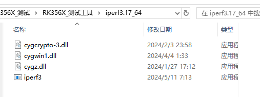

---

[TOC]

---

# 一、环境与工具
## 1.1 RK356X所需工具
```
memtester / mbw / htop / stress / fio / iperf3 
(这些工具在烧录时已经安装)
```
## 1.2 终端工具
```
MobaXterm (此工具在RK356X_测试工具中)
```
<br>
<br>
<br>

---

# 二、测试前准备
## 2.1 固件烧录
> 首先需要准备一根具有数据传输能力的typec线，连接PC端与板子，<br>
  PC端需要安装驱动程序，<br>
驱动程序在 RK356X_测试工具\RK_烧录\rk_tools\windows\DriverAssitant_v5.11\DriverAssitant_v5.1.1 之中;<br><br>
 PS:对于已存在固件的板子来说，需要上电前长按boot键，然后再上电，
对于空板(内部无固件的板子)来说，不需要额外操作；<br><br>
之后打开烧录工具,<br>
烧录工具在 RK356X_测试工具\RK_烧录\rk_tools\windows\RKDevTool\RKDevTool_Release 之中;<br><br><br>
进入烧录工具后，点击<升级固件>-<固件>进行固件选择,点击升级即可烧录;
<br>

## 2.2 iperf3准备
> 在进行千兆网口测试的时候, PC端也需要有iperf3

> 首先找到iperf3的文件, 在RK356X_测试工具\iperf3.17_64之中, <br>
> 接着按 WIN+R 进行运行, 输入 %SystemRoot% , 跳转到Windows文件夹中,iperf3中的所有内容复制到Windows文件夹中

> 我们可以按 WIN+R 输入cmd, 输入 iperf3 -s 进行观察是否安装成功.<br>

<br>
<br>
<br>

---


# 三、基本操作
## 3.1 基本命令
```
cd /                     返回根目录
cd ./xxx                 到当前目录中，xxx文件夹中
cd ../                   返回上一级
pwd                      查看当前路径
ls                       查看当前目录下所有文件
chomod 777 xxx           用于给脚本权限
./xxx >>  aaa.txt        执行xxx 并把结果保存在aaa.txt中
cat xxx                  查看xxx的内容
df -mh                   查看存储空间
&           让程序在后台运行
            如 ./cpu.sh >> abc.txt &
            即为让 cpu.sh 这个脚本后台运行，并且把日志存储在当前目录下abc.txt中

```

## 3.2 MobaXterm 使用
### 3.2.1 串口连接
> 点击左上角的 Session 按钮<br>
> 选择 Serial 串口选项 <br>
> <br>
> 
> 选择 串口号 与 波特率, 波特率可选115200 <br>
> PS:在启动时,串口会打印信息, 开头乱码部分需要用1500K波特率查看;<br>
>

### 3.2.2 网口连接
> 首先将 板子 与交换机连接, PC端也与交换机连接;<br><br>
> 
> 板子使用串口连接, 进入终端输入 ifconfig<br>
> 获取到当前 板子分配到的IP地址;<br>
> 此处为 192.168.80.142<br>
> <br>
> <br>
> <br>
>
> 点击 MobaXterm 左上角的 Session 选择 SSH<br>
> 输入刚刚从串口处获取的 IP地址 , 用户名我们默认用 root , 端口号选择 22<br>
> 点击OK即可连接;
> 

### 3.2.3 网口连接可多开
> SSH连接区别于串口连接, SSH连接可以开启多个终端, 而串口仅能开启一个终端窗口;

> 在左侧窗口栏双击 需要打开的 板子IP地址,<br>
> <br>
> <br>
> 即可实现开启多个终端窗口<br>
> <br>

> 除了上述内容, 使用 SSH 连接, 可以在 MobaXterm 中使用检测工具,<br>
> <br>
> 点击左侧窗口处, 左下角的小黄球<br>
> <br>
> <br>
> 之后点击左下角的监控按钮<br>
> <br>
> <br>
> 即可查看部分内容<br>
> <br>

### 3.2.4 上传与下载
> 点击左侧窗口处的 上传与下载按钮 即可实现PC端与板子进行文件交互;<br>
> 我们可以用此进行 脚本上传 与 输出日志下载;<br>
> <br>

### 3.2.5 脚本使用与日志输出
> 假设目前软件部门通过PC端发送脚本文件过来,<br><br>
>
> 我们可以先将脚本上传到板子中,<br>
> 此处我将监测脚本存在根目录下的 userdata文件夹中 (userdata 空间大)<br>
> <br>
>
 
> **脚本使用:**<br>
> ```
> cd /userdata      //进入根目录下的userdata中
> ls                //查看当前目录下的内容
> chmod 777 cpuMonitor_V1_20241106.sh       //给予脚本权限
> ./cpuMonitor_V1_202241106.sh >> cpuTempMonitor_20241106.txt &         //将脚本后台运行,输出日志存于当前目录下的 cpuTempMonitor_20241106.txt 之中
> ```


<br>
<br>
<br>

---

# 四、CPU测试
## 4.1 CPU压力测试
> <br>
> 1.查看是否安装stress , 并且可以确认当前版本；
> 
> ```
> stress --version
> ```
> 
> ```
> 返回结果:
> 
> root@OpenWrt:/userdata# stress --version
> stress 1.0.4
> root@OpenWrt:/userdata#
> ```
>
> <br>
>
> 2.查看CPU核心数量<br>
> ```
> cat /proc/cpuinfo | grep processor | wc -l
> ```
> ```
> 返回结果:
> 
> 4
> ```
>
> <br>
>
> 3.开启检测(脚本方式)<br>
> 脚本使用中有介绍, 此处不加以说明;<br>
>
> 4.开启过温保护<br>
>
> 5.开启压力测试<br>

## 4.2 CPU温升测试
> 首先搭好测试环境,进行压力测试<br>
> 每过一段时间记录环境温度;<br>
> CPU温度因为隔着散热片, 故以 log 为准;<br>

<br>
<br>
<br>

---

# 五、DDR测试
