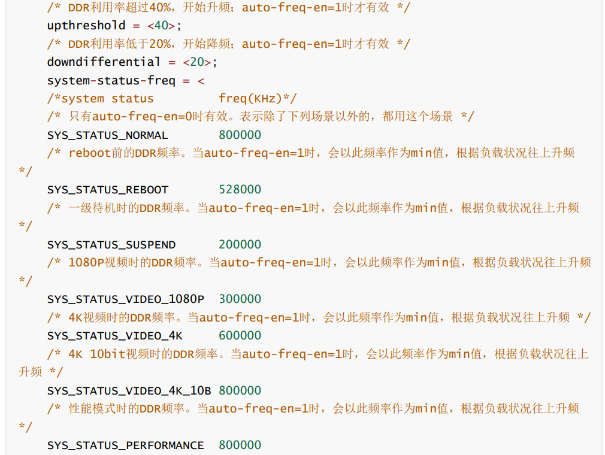
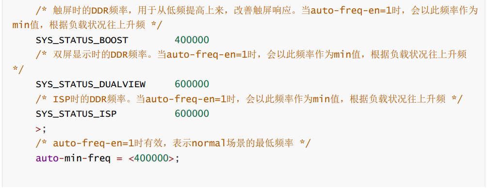
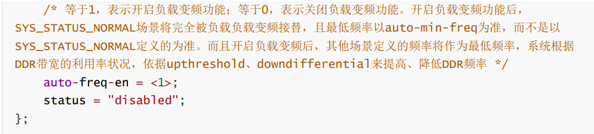
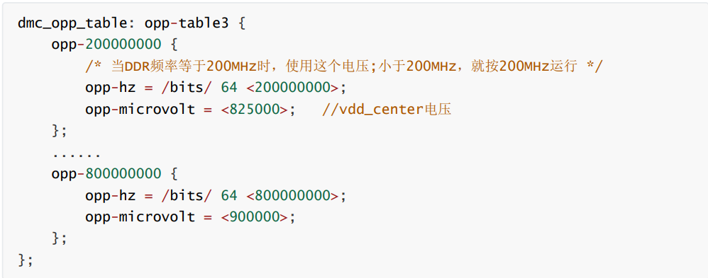
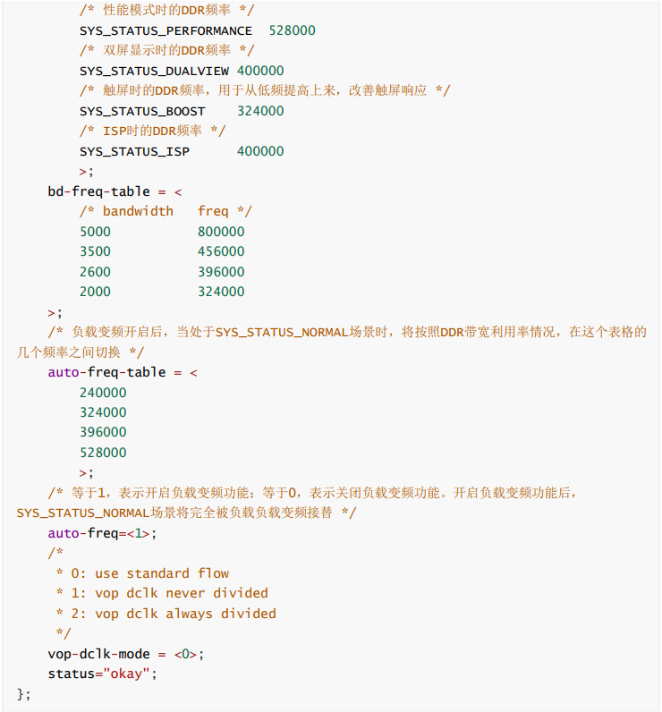

<!--
 * @Author: Connor2Chen 397080067@qq.com
 * @Date: 2024-11-04 09:49:52
 * @LastEditors: Connor2Chen 397080067@qq.com
 * @LastEditTime: 2024-11-04 11:50:24
 * @FilePath: \01_P_Learning\RK356X\RK356X测试.md
 * @Description: 
 * 
 * Copyright (c) 2024 by ${git_name_email}, All Rights Reserved. 
-->

---

[TOC]

---

# CPU测试
## 一、CPU负载压力测试
### 1.例程代码
说明：使用stress或者stress-ng进行压力测试；<br>
例程代码如下：<br>
```
stress --cpu 0-$(nproc) --timeout 30s --verbose
```
其中：<br>
stress : 调用压力测试工具;<br>
--cpu : 指定施加压力的CPU核心;<br>
0-$$(nproc) : 其中$(nproc)指获取当前系统可用的核心，那么0-$(nproc)就是指获取所有核心，nproc会输出当前系统的核心数量;<br>
-- timeout 30s : 压力测试持续30s;<br>
--verbose : 输出详细信息;<br>


### 2.安装环境
```
sudo apt install stress-ng
```


### 3.按要求测试代码
**需求:**
<br>使用stress/stress-ng等工具指定CPU的负载率设置为70%，<br>持续运行72小时以上，模拟CPU的高负载状态。持续运行，直到手动终止。测试时需关闭其他进程.<br>
<br>
**方案一：**<br>
```
stress-ng --cpu x --cpu-load 70 --timeout 259200 --verbose 
```
其中x为CPU的核心数；<br>
<br>
**方案二：**<br>
```
stress-ng --cpu 0-$(nproc) --cpu-load 70 --timeout 259200 --verbose
```

### 4.监控工具
**top:**<br>
终端输入top后，每几秒会输出一次内容<br>
其中包括（CPU使用情况）（内存使用情况）（进程列表）<br>
快捷键：<br>
q（退出top）<br>
M（按内存使用量排序）<br>
P（按CPU使用量排序）<br>
k（结束一个进程，需要输入要杀掉进程的PID）<br>

**htop:**<br>
```
sudo apt install htop        //安装htop
```
常用快捷键：
F10：退出 htop<br>
F3：搜索进程<br>
F5：切换到树状视图<br>
F6：选择排序方式<br>

**mpstat:**<br>
```
sudo apt install sysstat   //安装mpstat
```
```
mpstat -P ALL 1   //-P ALL：显示所有 CPU 的统计信息,1：每秒更新一次输出
```

### 5.退出stress
```
Ctrl+C    //直接关
```
```
pgrep stress-ng   //找PID
kill <PID>      //杀掉
killall stress-ng  //多个进程时适用
```

<br>
<br>
<br>


# DDR测试（环境kernel）
## 一、DDR容量确认
### 1.显示内存信息
**例程代码**<br>
```
root@rk3399:/ # cat /proc/meminfo   //猜测使用RK3568时输入root@rk3568:xxx
```
**字段解释**<br>
MemTotal: 系统总内存量<br>
MemFree: 当前可用的空闲内存<br>
MemAvailable: 当前可用内存的估计值（可用于新的应用程序）<br>
Buffers: 用于缓冲区的内存量<br>
Cached: 被文件系统缓存的内存量<br>
SwapTotal: 总交换区内存<br>
SwapFree: 当前可用的交换内存量<br>
Active: 当前正在使用的内存量（活跃页面）<br>
Inactive: 不活跃的内存页面<br>

## 二、最高频率测试
### 1.1修改DDR频率（kernel 4.4）
首先找到dts中的dmc节点，<br>

    如RK3399 EVB 板的 dmc 节点在 
    arch/arm64/boot/dts/rockchip/rk3399-evb.dtsi 和 
    arch/arm64/boot/dts/rockchip/rk3399.dtsi，

**参数说明(频率):**<br>
<br>
<br>
<br>

**PS：**<br>
kernel 4.4 的频率电压跟 kernel 3.10 不同，只有频率等于 dmc_opp_table 所列 opp-hz 
的，才会按该频率运行；小于 opp-hz，频率会向上取；如果频率超过这个表格的最大 opp-hz，只会按
最大 opp-hz 工作。所以，如果不想频率被向上取，或被限制到最大 opp-hz，dmc_opp_table 也是需
要关注的。


**操作:**<br>
令auto-freq-en = <0>;然后来修改频率

### 1.2修改DDR频率（kernel 3.10）
首先要找到dts中的clk_ddr_dvfs_table节点，<br>

    如RK3288 SDK 板的最终的 clk_ddr_dvfs_table 
    在 arch/arm/boot/dts/rk3288-tb_8846.dts 中

**参数说明(频率):**<br>
<br>
<br>

### 2.修改DDR频率所对应的电压(使用命令)
**kernel 4.4：**<br>
需要编译 kernel 时，打开 pm_tests 选项(make ARCH=arm64 menuconfig ->Device 
Drivers -> SOC （System On Chip) specific Drivers -> Rockchip pm_test support )

<br>

**kernel 3.10：**<br>
需要编译 kernel 时，打开 pm_tests 选项(make menuconfig ->System Type -> 
/sys/pm_tests/ support )

**修改电压命令**<br>
RK3399： 
```
echo set vdd_center 900000 > /sys/pm_tests/clk_volt     //逻辑电压设置为0.9V
```
其他： 
```
echo set vdd_logic 1200000 > /sys/pm_tests/clk_volt     //逻辑电压设置为1.2V
```

### 3.确定DDR能运行的最高频率
1.添加高频电压表;<br>
2.从高频到低频，运行 google stressapptest，碰到报错，就降低频率，再运行。没报错，可以多运
行一段时间，还是没报错，进入下一步。<br>


